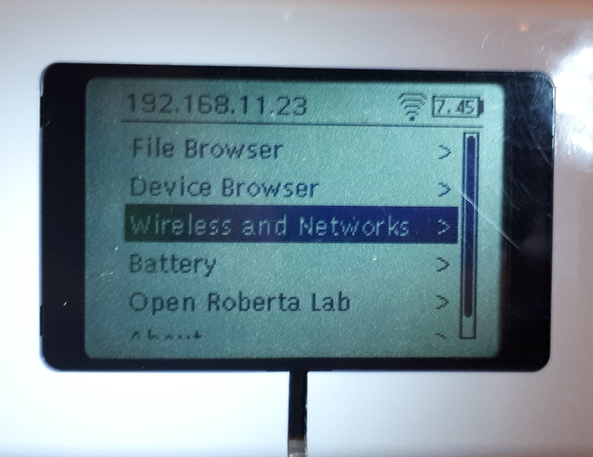
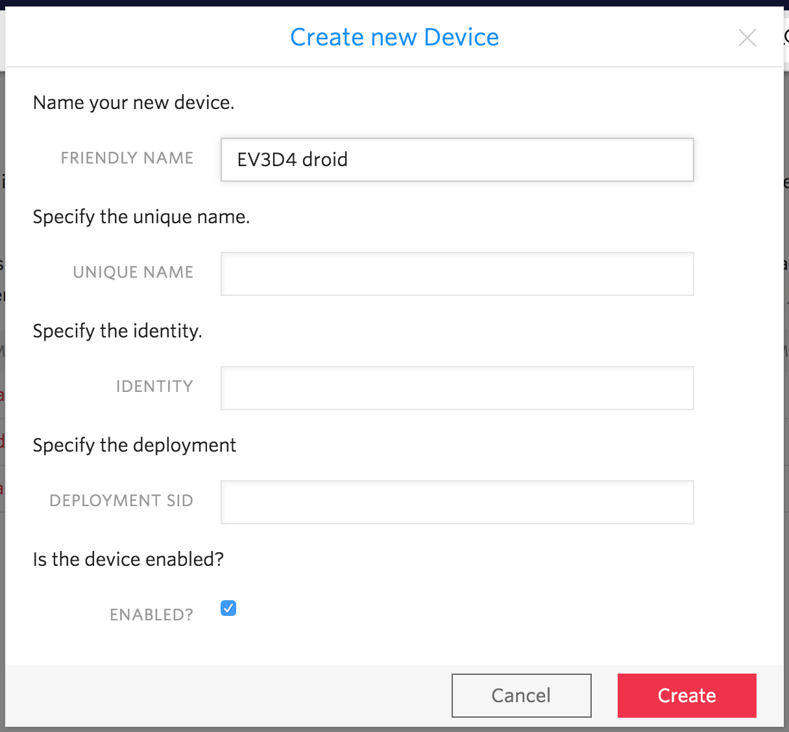
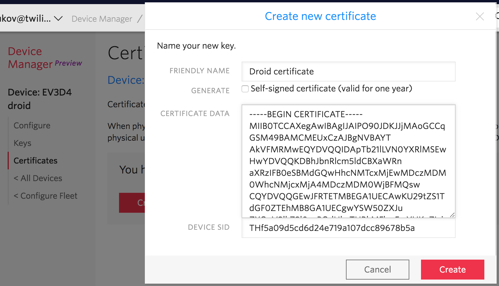
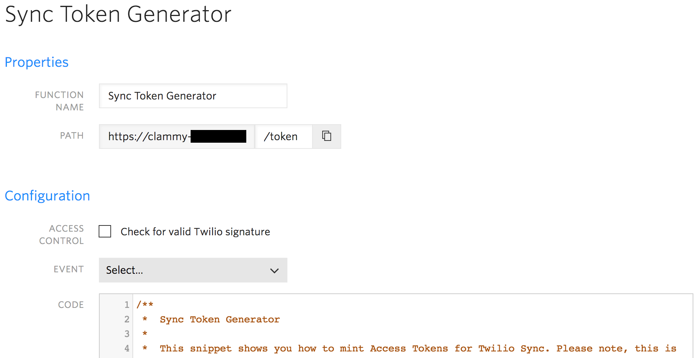
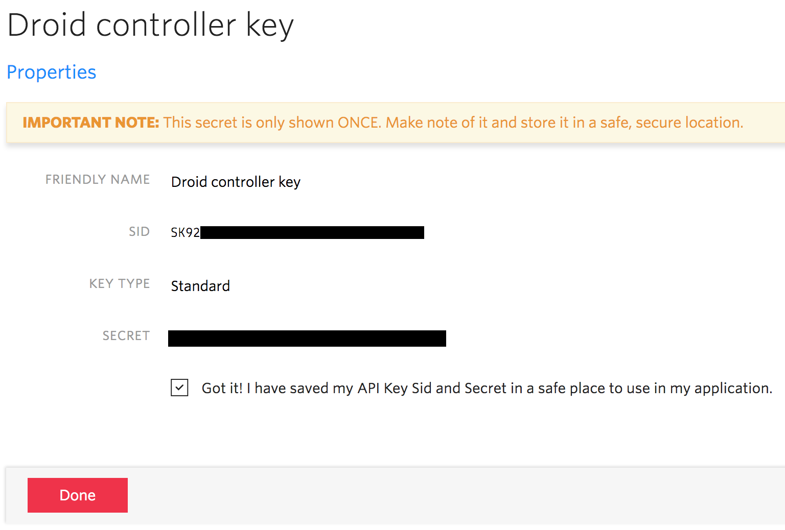
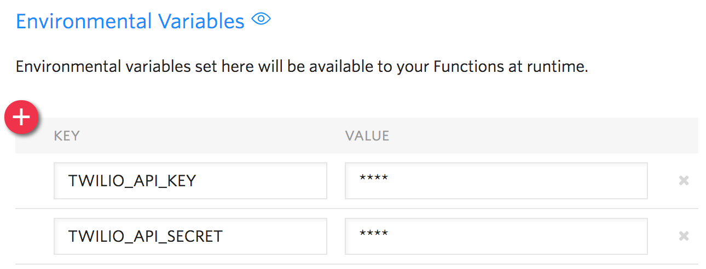
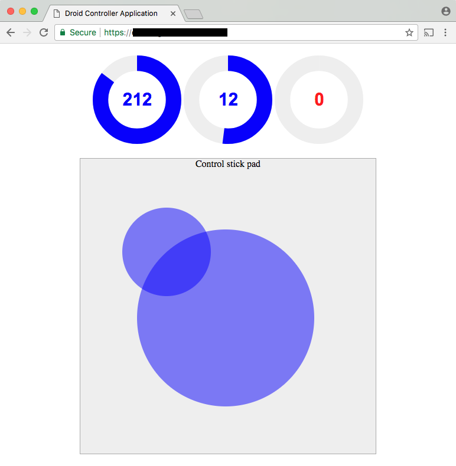

# Building a Remote-Controlled Droid with Twilio Sync

The world of Internet connected devices is exploding, with billions of them already online. Today we thought that smart thermostats and fridges are boring, and went straight to programmable droids instead.

## Building Your Droid

To keep this little project entertaining, repurposable and extensible, we are going to use Lego Mindstorms EV3 set, which is a popular platform for basic robotics builds.

Key ingredients include:
- Lego [Mindstorms EV3](https://www.lego.com/en-us/mindstorms) kit.
- A compatible WiFi USB dongle, one from [this list](http://www.ev3dev.org/docs/networking).
- 2GB or larger microSD card to install EV3dev image.
- Spare AA batteries.

### Assemble Hardware

Follow these online instructions to assemble the EV3D4 droid. Once done, don’t forget to plug in a WiFi USB dongle to enable direct connectivity to Internet. We used Edimax EW-7811UN.

Ultimately, you should get something like this:

As you could observe, this droid has the following peripherals.
- Output port A: small motor to pivot head
- Output port B: right large motor to propel and steer the droid
- Output port C: left large motor
- Input port 1: switch sensor
- Input port 3: color sensor to recognize objects
- Input port 4: ultrasonic proximity sensor to measure distance

### Install Custom OS

We are going to use EV3dev in order to deploy custom applications to your droid. EV3dev is a Debian Linux based operating system that turns Mindstorms bricks into a flexible application platform. Don’t worry, we are leaving your original EV3 firmware untouched, and you’ll be able to get back to normal mode of operation anytime, by just removing the bootable microSD card with EV3dev image.

Follow the step-by-step instructions on EV3dev site to download and install OS image onto your microSD card. Boot it for the first time and connect to your local WiFi network using Brickman’s "Wireless and Networks > Wi-Fi" menu.

### Deploy the Application

Once booted up, and connected to WiFi, try logging into to your droid via SSH. The default username is "robot" and password is "maker"; feel free to change it.

    $ ssh robot@192.168.11.23

Our first application is going to be a basic Python script that connects to Twilio Sync for IoT, drives motors and captures input from sensors using [EV3 Python language bindings](https://github.com/ev3dev/ev3dev-lang-python). First, clone our project repository containing client.py script from GitHub to your machine.

On your development host, execute the following to fetch the code and copy it to ev3dev.

    $ git clone https://github.com/dr0nius/twilio-mindstorms
    $ scp twilio-mindstorms/ev3-client/client.py robot@192.168.11.23:~/

Then, install dependencies. Most of the things are pre-installed already, but we’ll need a compact MQTT client in order to connect to Twilio cloud. While connected to ev3dev, execute the following.

    $ sudo apt-get update
    $ sudo apt-get install python3-pip
    $ sudo pip3 install paho-mqtt

EV3 isn’t exactly a blazing fast Linux platform, as it’s running on a fairly low-power microcontroller. Give it some time to complete above, and have a coffee or tea meanwhile. Good news is that it only needs to be done once.

## Connecting Your Droid

In order to get the droid online and operable, we are going to need a few Twilio tools and services.

- First, a Twilio account: [follow this link](https://www.twilio.com/try-twilio) to create one it if you haven’t done it already.
- Sync [Document](https://www.twilio.com/docs/api/sync/sync-documents) object to control the state of droid motors.
- Sync [Message Stream](https://www.twilio.com/docs/api/sync/sync-objects-overview/message-streams) to receive droid sensor updates.
- Runtime [Assets](https://www.twilio.com/docs/api/runtime/assets) to host the operator’s controller web application.
- Runtime [Functions](https://www.twilio.com/docs/api/runtime/functions) to generate an authentication token for browser access.
- Completed [application request](https://www.twilio.com/sync/iot) to enable Sync for IoT device manager, which is currently in developer preview cycle.

Up until this point, we didn’t have a way to securely identify and trust the connected droid within our remote control application. Let’s fix that by creating its unique identity and a client certificate for authentication purposes.

### Create an Identity

Navigate to [Sync for IoT console](https://www.twilio.com/console/devices) and click on "Visit the Device Manager". We have an empty fleet automatically provisioned for you, called "Default Fleet".

- Under the [default fleet](https://www.twilio.com/console/devices/fleets/default/devices), click "Create a Device" button.
- Provide a friendly name, e.g. "EV3D4 droid" and make sure "Enabled" is checked.
- Click "Create" to finish.

### Authenticate the Device

Now that we have established the droid identity, let’s add a client certificate in order to authenticate it with the backend.

When logged in to ev3dev, go to the home directory where the client.py script resides already, and generate a new private key, storing it to ev3d4.key.pem file. Keep this key secret, it should never leave the device.

    $ openssl ecparam -genkey -name prime256v1 -out ev3d4.key.pem

Then, while in the same directory, generate a self-signed certificate based on the above key, and store it to ev3d4.cert.pem file. When prompted for certificate attributes, enter whatever you like best, as it doesn’t make a difference to device management.

    $ openssl req -new -x509 -sha256 -days 3650 -key ev3d4.key.pem -out ev3d4.cert.pem
    ...
    $ cat ev3d4.cert.pem
    -----BEGIN CERTIFICATE-----
    MIIB0TCCAXegAwIBAgIJAIPO90JDKJJjMAoGCCqGSM49BAMCMEUxCzAJBgNVBAYT
    …
    -----END CERTIFICATE-----

The certificate part is obviously public, and we are now going to copy it to Sync for IoT device manager. Go back to your "EV3D4 droid" device in Twilio console.

- Under the "EV3D4 droid" menu, pick "Certificates" section and click "Create a Certificate".
- Call it e.g. "Droid certificate" in the friendly name field.
- Leave the device SID unchanged.
- Click "Create".

### Build a Controller

Our controller application is going to be browser based, enabling bidirectional communication between a human operator and the remote droid. We are going to use a couple of Twilio Sync objects to deliver state updates both ways.

1. Sync Document called "motors". As soon as the controller stick starts moving, the motors are driven forward or backwards, and their desired speed is stored to the JSON document. Here is an example of the motor state snapshot:

       {
         "l1": -64,
         "l2": -120
       }

2. Sync Message Stream called "sensors". Once started, the ev3dev python application will begin reporting readings from infrared, touch and color sensors. Since these reports are periodic and ephemeral by nature, we don’t really want to persist them. Here is an example of a posted JSON message:

       {
         "ir": 100,
         "touch": 0,
         "color": 36
       }

#### Publishing Assets

The JavaScript controller application is packaged into a single HTML file, added to our GitHub. It relies on [twilio-sync.js](https://www.twilio.com/docs/api/sync/quickstart-js) SDK to do all of the low level state replication and websocket messaging work, so that the application is kept simple and lean.

We are also going to make the controller application serverless, and execute it using Twilio Assets and Functions. First, let’s upload the HTML/JS code and make it an Asset.

- Navigate to [Runtime Assets](https://www.twilio.com/console/runtime/assets) console and click "Add an Asset".
- Pick twilio-mindstorms/controller/index.html file under the project location.
- Observe a number of toast notifications, with the final one reporting "Your Asset has successfully been deployed".
- Note your personal asset URL, it should look like e.g. https://amazing-owl-4242.twil.io/

#### Generating Access Tokens

One last thing is needed to make our droid controller fully functional. Twilio authenticates your browser application running on an arbitrary machine using a JWT [access token](https://www.twilio.com/docs/api/rest/access-tokens), and authorizes access to Sync resources [using grants](https://www.twilio.com/docs/api/sync/identity-and-access-tokens). We are going to compose your Sync token generator and host it as a Function.

- Navigate to [Runtime Functions](https://www.twilio.com/console/runtime/functions/manage) console and click "Create a Function".
- Pick "Blank" as the template and click "Create".
- Function name: type "Sync Token Generator".
- Path: type "/token".
- Code: copy & paste the content of _twilio-mindstorms/token-generator/token.js_ file.
- Click "Save" and observe toast notifications. The last one should say "Your Function has successfully been deployed".

In order for the token generator to apply a valid signature, we will also need an API signing key.

- Navigate to [Sync Tools](https://www.twilio.com/console/sync/tools) console and click “Create new API Key”.
- Friendly name: type “Droid controller key”.
- Key type: leave as “Standard”.
- Note the resulting SID and Secret fields, we are going to need to use them in the token generator.

- Navigate to [Functions Configuration](https://www.twilio.com/console/runtime/functions/configure) console.
- Under “Environment Variables”, click the “(+)” button and set “TWILIO_API_KEY” as the name. Copy & paste API key SID from the earlier step as its value.
- Add another variable called “TWILIO_API_SECRET” and copy & paste API key secret as its value.
- Click “Save” and observe a confirming toast notification.

### Fire it Up
Finally, let’s put all the components together and make the ultimate test run.

1. On your development machine, open your asset URL in the browser. This will automatically create Sync list and message stream that will be used to interact with the droid.

2. Then, when connected to ev3dev, execute the client application.
       $ python3 client.py
       Connected with result code 0

3. Now, press and hold in the “Control stick pad” area to drive your droid around. Observe the proximity gauge to change if there is an obstacle in front of it. It also works with a trackpad or touchscreen device, open it on your phone and observe motor and sensor states changing live in all applications.

## Liberating Your Devices with Twilio

This particular project addresses generic remote control and dashboarding scenarios, and can be extended further. For example, consider the following tweaks:

- Add the missing color sensor to controller UI and start tracking it live.
- Add a second “stick” handler to the control pad and pivot droid’s head using multi-touch.
- Attach a special trigger to touch sensor and hook it up to another Function using [webhooks](https://www.twilio.com/docs/api/sync/webhooks); make it send an SMS or ring a phone.
- Deploy a fleet of droids and build a dashboard to monitor them in real time.

Many IoT projects have the same baseline problem to solve: they need to enable reliable, secure, low-latency information flow between heterogeneous endpoints: embedded devices, server backends, first-person clients such as browser and mobile phones. Twilio simplifies the development of your IoT applications by providing a set of basic building blocks, similarly to Legos. Combining these blocks and APIs allows you to reduce cost and move faster from concept to prototype to production application.

We can’t wait to see what you build next!
